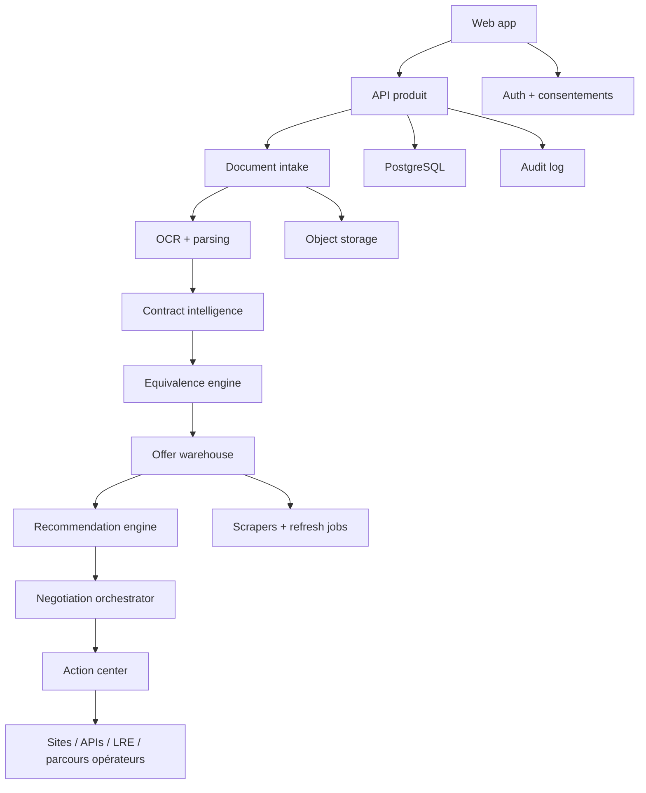

# Architecture Cible

## Principe

Architecture simple, orientée dossiers, avec peu d'agents et beaucoup de traçabilité.

## Composants

### 1. Web app

- onboarding ultra court;
- import de PDF, facture, capture d'écran, email forward;
- espace "mes contrats";
- centre de recommandations;
- page publique "observatoire des prix".

### 2. Document intake

- stocke les documents bruts;
- calcule le hash;
- versionne les réimports;
- déclenche les jobs d'extraction.

### 3. Contract intelligence

Mission:

- extraire les champs structurants;
- détecter le secteur;
- reconstruire le coût réel annuel;
- estimer la confiance par champ.

Champs critiques:

- fournisseur;
- offre;
- prix actuel;
- promo et date de fin;
- engagement et date de fin;
- adresse / code postal;
- options;
- garanties et franchises en assurance.

### 4. Offer warehouse

Entrepôt unique des offres normalisées:

- offres canoniques;
- snapshots quotidiens;
- règles d'amortissement des promos;
- historiques de prix;
- métadonnées de qualité et d'éligibilité.

### 5. Equivalence engine

Le composant le plus important.

Il ne cherche pas "l'offre la moins chère", il cherche "l'offre la moins chère acceptable".

Règles:

- énergie: équivalence assez simple;
- mobile: équivalence conditionnée par la couverture et les usages;
- internet fixe: équivalence conditionnée par la technologie disponible à l'adresse;
- assurance: équivalence conditionnée par une matrice minimale de garanties.

### 6. Negotiation orchestrator

Ordre recommandé:

1. tester la rétention chez le fournisseur actuel;
2. si l'écart reste significatif, préparer le switch;
3. si la confiance d'équivalence est faible, escalader à l'utilisateur.

### 7. Action center

Canaux d'action:

- résiliation en ligne;
- souscription chez le nouvel acteur;
- portabilité;
- courrier / LRE;
- génération de script d'appel;
- suivi des preuves et des dates.

## Agents

Flow agentique volontairement court:

- `extractor-agent`: transforme documents bruts en JSON fiable;
- `equivalence-agent`: compare contrat actuel et offres candidates;
- `negotiation-agent`: génère les actions de rétention ou de switch;
- `compliance-agent`: bloque les actions risquées ou non couvertes;
- `orchestrator`: séquence et journalise.

Règles:

- un seul orchestrateur;
- pas d'action externe sans trace d'approbation;
- pas de mutation silencieuse d'un dossier;
- chaque agent écrit un rationnel court et structuré.

## Stack recommandée

### Produit

- frontend: Next.js + TypeScript;
- API: FastAPI;
- DB: PostgreSQL;
- queue/jobs: Redis + workers Python;
- stockage: S3 compatible;
- scraping: Playwright + extraction HTML structurée;
- auth: Auth.js ou équivalent self-hostable;
- step-up auth: OTP ou signature d'approbation pour chaque action engageante;
- observabilité: OpenTelemetry + logs JSON.

### Modèles

Par défaut, garder une couche de modèles interchangeable.

Recommandation:

- extraction et classification: `Mistral Small 3.2 Open` ou `gpt-oss-20b`;
- raisonnement plus coûteux: `Magistral Small 1.2 Open` ou `gpt-oss-120b`;
- génération de code / scrapers / outils internes: `Devstral 2 Open`;
- fallback optionnel, non requis pour l'open-source: `GPT-5.4` sur cas ambigus seulement.

Cette combinaison garde un chemin self-hostable, gratuit pour la communauté et assez moderne pour un produit agentique simple.

## Contrat de confiance technique

Le produit doit pouvoir prouver:

- d'où vient chaque donnée;
- quel modèle a produit quelle sortie;
- quel humain a validé quelle action;
- quelle preuve de notification ou de souscription a été reçue.

Sans ça, le produit n'est pas exploitable à l'échelle.
