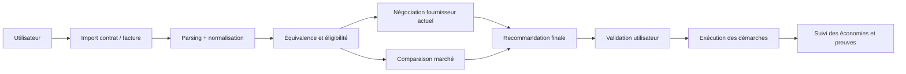

# Plan Produit

## Problème

Les foyers français accumulent des contrats récurrents qui dérivent avec le temps:

- promotions expirées;
- options devenues inutiles;
- réengagements opaques;
- hausses unilatérales de prix;
- inertie administrative.

Le vrai problème n'est pas l'absence de comparateurs. Le vrai problème est l'écart entre:

- savoir qu'une meilleure offre existe;
- être capable d'évaluer son équivalence réelle;
- exécuter proprement le changement ou la renégociation.

## Proposition de valeur

Le produit prend un contrat existant, comprend ce qu'il contient, mesure ce qu'il vaut face au marché, puis pousse l'utilisateur vers la meilleure décision exécutable.

Sortie attendue:

- économie estimée en euros;
- niveau de risque de changement;
- qualité de service attendue;
- effort administratif quasi nul.

## Cible

Priorité:

- foyers urbains et périurbains multi-contrats;
- profils "je paie trop cher mais je n'ai pas le temps";
- early adopters à l'aise avec l'import de factures.

Plus tard:

- indépendants / petits pros;
- syndics / gestionnaires de biens;
- courtiers en marque blanche.

## Ordre de lancement

### V1: électricité + gaz

Pourquoi:

- meilleure commoditisation;
- changement gratuit;
- pas de coupure de service;
- résiliation automatique par le nouveau fournisseur;
- comparateur officiel existant.

### V1.5: forfait mobile

Pourquoi:

- portabilité du numéro bien cadrée;
- offres très comparables;
- forte sensibilité prix.

Contrainte:

- ne jamais recommander sans intégrer la couverture et la qualité locale.

### V2: box internet fixe

Pourquoi:

- gains unitaires élevés;
- bundling fréquent avec mobile / TV.

Contrainte:

- éligibilité à l'adresse indispensable;
- restitution de matériel;
- qualité très dépendante de la techno disponible.

### V3: assurance habitation / auto

Pourquoi:

- gros gisement d'économie.

Contrainte:

- pas une vraie commodité pure;
- équivalence de garanties complexe;
- souscription plus dépendante du profil assuré.

## Ce qu'il ne faut pas faire en MVP

- promettre un changement automatique sur toutes les verticales;
- scraper des parcours d'assurance dynamiques avant d'avoir un cadre propre;
- lancer une négociation vocale "agent autonome" avant d'avoir un audit trail complet;
- faire un classement uniquement par prix mensuel.

## Flow utilisateur cible

## Score de recommandation

Le moteur doit classer les options avec un score composite:

- coût total annualisé;
- équivalence fonctionnelle;
- qualité de service locale;
- friction de changement;
- risque contractuel;
- confiance du moteur d'extraction.

Exemples:

- énergie: le prix pèse fortement;
- mobile: le prix sans couverture n'a aucune valeur;
- assurance: le prix doit être borné par une matrice de garanties minimales.

## KPI de départ

- économie nette annualisée par foyer;
- taux de recommandation acceptée;
- taux de rétention réussie chez le fournisseur actuel;
- temps médian entre import et recommandation;
- taux d'exécution sans intervention support;
- taux de litige post-switch;
- précision d'extraction par champ critique.

## Modèle open-source et gratuit

Base recommandée:

- code source public;
- self-host gratuit;
- offre communautaire gratuite;
- monétisation ultérieure hors coeur open-source via marque blanche, APIs B2B ou accompagnement premium.

Ce cadrage évite de casser la promesse "open-source et gratuit" tout en laissant une voie de financement si le produit prend.

## Critère de succès MVP

Le MVP est bon s'il sait faire ceci proprement:

- comprendre une facture réelle;
- proposer 1 à 3 alternatives crédibles;
- exécuter au moins une action utile de bout en bout;
- produire des preuves horodatées;
- économiser réellement de l'argent sur les deux premières verticales.
